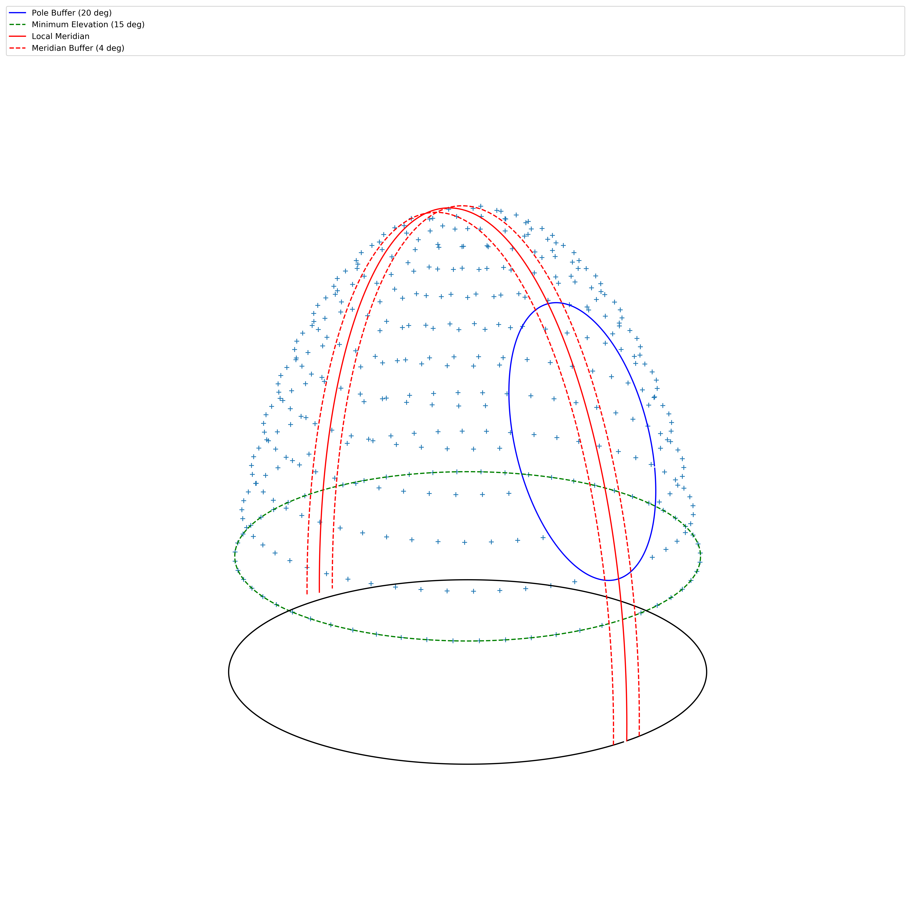
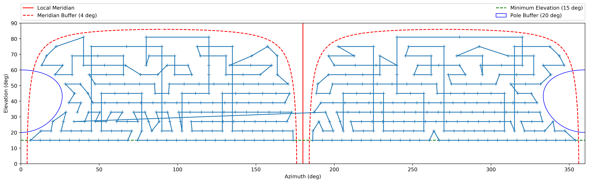
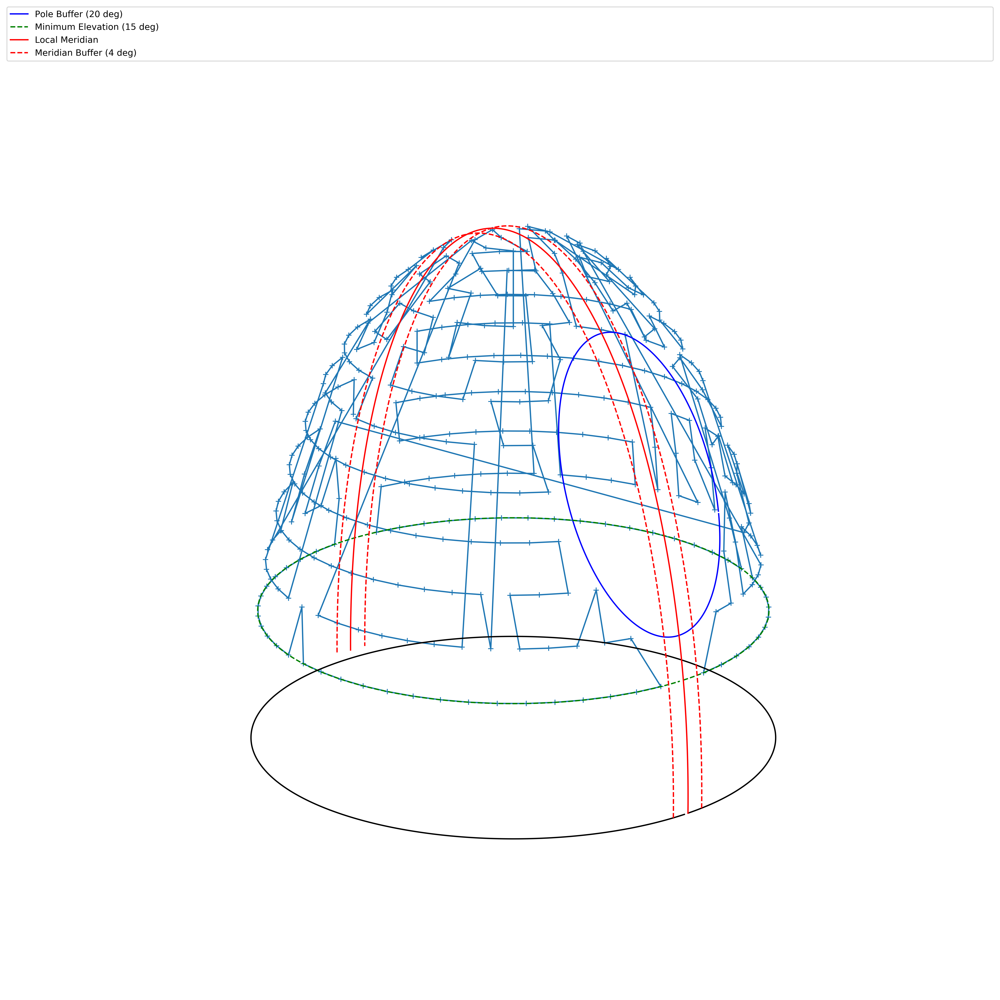

# tpoint.py : Automated Telescope Alignment

I wanted to automatically generate tpoint alignment files for use with TheSkyX (TSX).  Eventually I will include a mount model library to use the tpoint files outside of TSX.  I need to do something like this:

1. Generate a set of survey points
2. For each survey point:
	* Slew to the survey point
	* Integrate
	* Save frame to disk with relevant metadata in FITS header
3. For each FITS file:
	* plate solve
	* store solution (if any) in FITS header
4. Compile tpoint file from aggregate FITS header data 

## Usage

### Within Python

Download or clone this repo, and use it.  Requirements are in [requirements.txt](requirements.txt).  To install them to your python environment run the following from the top directory:

```
pip install -r requirements.txt
```

### Windows Executable

Download tpoint.exe from this repo.  Place [test_input.json](test_input.json) in the same directory as the executable.  Run it.

## Details

All the survey parameters are defined in one json object.  Here is the example input:

Example input:
```javascript
{
   "location":{
      "lat":40,
      "lon":-84
   },
   "camera":{
      "fov":10,
      "exposure":1
   },
   "survey":{
      "area":8,
      "buffers":{
         "meridian":4,
         "pole":20
      },
      "masks":{
         "elevation":{
            "min":5
         }
      }
   },
   "astrometry":{
      "api":{
         "api_url":"http://nova.astrometry.net/api/",
         "key":"my_key"
      }
   },
   "files":{
      "fit_directory":"/path/to/fit/files"
   }
}
```

All angle units are in degrees... that's the only note I can think of here.

### Survey Grid

The survey is constructed using elevation masks, keep out zones around the local meridian and the celestial pole.  Grid density is determined by the "Area" parameter (deg<sup>2</sup>) which represents the average area assigned to each grid point ([see reference doc](reference/sphere_equi.pdf)).  The larger the area, the fewer the survey points.  This produces a regular distribution of points in spherical space (no increase in grid density near zenith).




### Survey Sequence

Once the survey grid is constructed, it's split into two sets along local meridian.  A survey sequence is developped using a solution to the ["Travelling Salesman Problem" (TSP)](https://en.wikipedia.org/wiki/Travelling_salesman_problem) for each half, and then they are rejoined.  The goal is to find "one of the fastest" routes through all the grid points, with only only one meridian flip.






### Telescope Automation

The "Survey" routine will build the survey as desribed above, and then automate the slew, integrate, save process for each point in the survey.  Currently it will run to completion, with no logging.  In the future, the survey session will have an associated file which logs progress and allows resuming a cancelled session using the same grid points and session key.  Below is an example of the output as the survey runs:

```
-------------------------------------
Sample 1 of 668
Time: 2018-02-04 10:21:12.615000
Session Key: 503b4a385e14ff2c1079f9b4c24c8d5e
Slewing... Az: 139.591836735 El: 47.5
Exposing for 1  seconds...
Exposing light frame...
Light frame exposure and download complete!
Setting FITS value: { tp_key : 503b4a385e14ff2c1079f9b4c24c8d5e }
Setting FITS value: { tp_ra : 20.47796847391697 }
Setting FITS value: { tp_dec : 4.532284384589539 }
Setting FITS value: { tp_utc : 2018-02-04T15:21:22.874000 }
Setting FITS value: { tp_lat : 40 }
Setting FITS value: { tp_lon : -84 }
Setting FITS value: { tp_LST : 18.728816248 }
saving FITS image to: C:\tpoint\503b4a385e14ff2c1079f9b4c24c8d5e_1.fits
-------------------------------------
Sample 2 of 668
Time: 2018-02-04 10:21:22.952000
Session Key: 503b4a385e14ff2c1079f9b4c24c8d5e
Slewing... Az: 132.244897959 El: 47.5
Exposing for 1  seconds...
Exposing light frame...
Light frame exposure and download complete!
Setting FITS value: { tp_key : 503b4a385e14ff2c1079f9b4c24c8d5e }
Setting FITS value: { tp_ra : 20.761592594977074 }
Setting FITS value: { tp_dec : 7.191821951744746 }
Setting FITS value: { tp_utc : 2018-02-04T15:21:29.253000 }
Setting FITS value: { tp_lat : 40 }
Setting FITS value: { tp_lon : -84 }
Setting FITS value: { tp_LST : 18.728816248 }
saving FITS image to: C:\tpoint\503b4a385e14ff2c1079f9b4c24c8d5e_2.fits
```